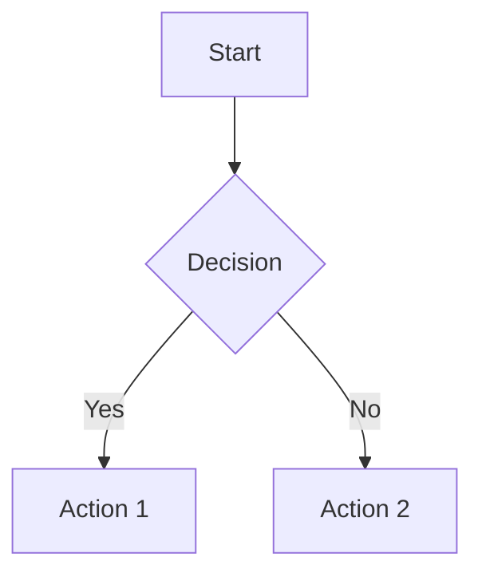

# ED Math Documentation

A documentation website for Elite: Dangerous mathematical formulas and calculations, built with Jekyll and hosted on GitHub Pages.

## Features

- 📝 Markdown-based content
- 🔍 Built-in search functionality
- 📱 Responsive design
- 📊 MathJax support for mathematical notation
- 🎨 Clean, modern UI
- Mermaid support
- Vega support

## Getting Started

### Prerequisites

- Ruby (version 2.5.0 or higher)
- RubyGems
- GCC and Make

### Local Development

1. Clone the repository:
   ```bash
   git clone https://github.com/yourusername/ed-math.git
   cd ed-math
   ```

2. Install dependencies:
   ```bash
   bundle install
   ```

3. Start the Jekyll server:
   ```bash
   bundle exec jekyll serve
   ```

4. Open your browser to `http://localhost:4000/ed-math/`

## Adding New Content

1. Create a new folder in the `pages` directory with a descriptive name (e.g., `combat-calculations`)
3. Create an `index.md` file with your content
4. Submit a pull request

### Example Structure

```
pages/
  combat-calculations/
    index.md
  mining-yields/
    index.md
```

## Math Support

This site supports LaTeX math notation using MathJax:

- Inline math: `$E = mc^2$`
- Display math: `$$\int_{-\infty}^{\infty} e^{-x^2} dx = \sqrt{\pi}$$`

## Mermaid Support

Add graphs using Mermaid syntax:



## Vega Support

Add visualizations using Vega syntax:

```vega
{
  "$schema": "https://vega.github.io/schema/vega/v5.json",
  "description": "A basic bar chart example, with value labels shown upon pointer hover.",
  "width": 400,
  "height": 200,
  "padding": 5,

  "data": [
    {
      "name": "table",
      "values": [
        {"category": "A", "amount": 28},
        {"category": "B", "amount": 55},
        {"category": "C", "amount": 43},
        {"category": "D", "amount": 91},
        {"category": "E", "amount": 81},
        {"category": "F", "amount": 53},
        {"category": "G", "amount": 19},
        {"category": "H", "amount": 87}
      ]
    }
  ],

  "signals": [
    {
      "name": "tooltip",
      "value": {},
      "on": [
        {"events": "rect:pointerover", "update": "datum"},
        {"events": "rect:pointerout",  "update": "{}"}
      ]
    }
  ],

  "scales": [
    {
      "name": "xscale",
      "type": "band",
      "domain": {"data": "table", "field": "category"},
      "range": "width",
      "padding": 0.05,
      "round": true
    },
    {
      "name": "yscale",
      "domain": {"data": "table", "field": "amount"},
      "nice": true,
      "range": "height"
    }
  ],

  "axes": [
    { "orient": "bottom", "scale": "xscale" },
    { "orient": "left", "scale": "yscale" }
  ],

  "marks": [
    {
      "type": "rect",
      "from": {"data":"table"},
      "encode": {
        "enter": {
          "x": {"scale": "xscale", "field": "category"},
          "width": {"scale": "xscale", "band": 1},
          "y": {"scale": "yscale", "field": "amount"},
          "y2": {"scale": "yscale", "value": 0}
        },
        "update": {
          "fill": {"value": "steelblue"}
        },
        "hover": {
          "fill": {"value": "red"}
        }
      }
    },
    {
      "type": "text",
      "encode": {
        "enter": {
          "align": {"value": "center"},
          "baseline": {"value": "bottom"},
          "fill": {"value": "#333"}
        },
        "update": {
          "x": {"scale": "xscale", "signal": "tooltip.category", "band": 0.5},
          "y": {"scale": "yscale", "signal": "tooltip.amount", "offset": -2},
          "text": {"signal": "tooltip.amount"},
          "fillOpacity": [
            {"test": "datum === tooltip", "value": 0},
            {"value": 1}
          ]
        }
      }
    }
  ]
}
```


## Deployment

This site is automatically deployed to GitHub Pages when changes are pushed to the `main` branch.

