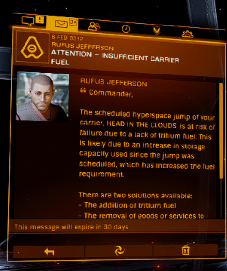
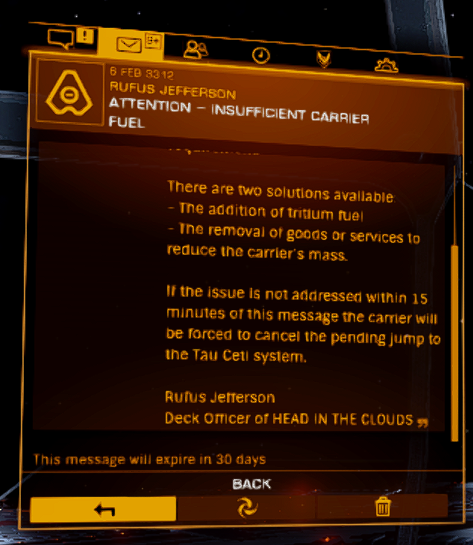
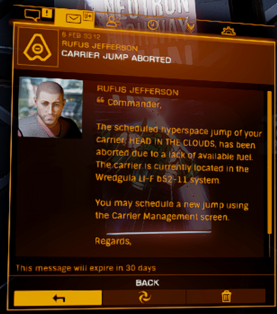

This document explains the mathematical formula used to calculate the amount of Tritium fuel required for a Fleet/Squadron Carrier's next jump.

## Overview

The fuel per jump is influenced by the distance of the jump and the used storage capacity of the carrier.
The exact fuel consumption is calculated at the time of the jump. It is possible to plot a course that is valid at the time of plotting but becomes invalid at the time of jumping if the fuel cost surpasses the available fuel due to changes in the used storage capacity of the carrier.
This will trigger some messages from the Deck Officer of the Carrier and ultimately in an [unknown failure](#failure-sequence).

## Formula

The fuel cost is calculated using the following formula:

$$
\text{fuel} = \text{round}\left(BASE\_FUEL\_PER\_JUMP + \frac{distance \times (capacityUsed + fuelInReservoir + carrierMass)}{200000}\right)
$$

Where:
- BASE_FUEL_PER_JUMP = 5 tons
- distance = Jump distance in light years
- capacityUsed = Current carrier capacity used (Crew + Cargo + CargoSpaceReserved + ShipPacks + ModulePacks)
- fuelInReservoir = Fuel in reservoir in tons. 0 - 1,000 tons
- carrierMass = 25,000 tons for the Fleet Carrier and 15,000 tons for the Squadron Carrier.

The minimum fuel cost for any jump is 5 tons of Tritium.

## Example Calculation

For a Fleet Carrier with:
- Jump distance (distance) = 500 Ly
- Current capacity used (capacityUsed) = 5,000 tons
- Fuel in reservoir (fuelInReservoir) = 1,000 tons
- Carrier mass (carrierMass) = 25,000 tons.

The calculation would be:

$$
\text{fuel} = \text{round}\left(5 + \frac{500 \times (5,000 + 1,000 + 25,000)}{200,000}\right)
$$

    fuel = round(5 + 500 * (5,000 + 1,000 + 25,000) / (8 * 25,000))
         = round(5 + 500 * 31,000 / 200,000)
         = round(5 + 77,5)
         = round(82,5)
         = 83 Tons

## Key Properties

- The fuel usage scales linearly with the distance of the jump and the used storage capacity of the carrier, but because of the flat addition of `BASE_FUEL_PER_JUMP` it is cheaper to jump the same distance in fewer jumps. For example jumping 2000Ly in 5 x 400Ly jumps costs 5T Tritium more than 4 x 500Ly jumps, no mather the storage capacity used. 
- The minimum fuel used is 5T and the maximum is 133T for the Fleet Carrier and 195T for the Squadron Carrier. In-system jumps of 0 Ly always cost 5T of Tritium, no mather the capacity or carrier used.
- If the jump is cancelled due to insufficient fuel, the fuel cost is not deducted from the carrier's fuel reservoir. 
- The fuel cost is only deducted when the jump is successfully executed. Manual cancellation in the 10-minute window after the request does not incur any costs.
- The squadron carrier is more fuel efficient than the fleet carrier and has more cargo capacity.

## Tips

- Up to 4T of tritium can be saved on a jump by placing cargo from the carrier into the cargo racks of a maxed out Panther Clipper(1304T)
- The UI in the game does not properly show the fuel cost for a jump in many cases. Don't rely on the values that are displayed.

## Failure sequence

This is the sequence of messages that the Deck Officer of the Carrier will say when the jump is attempted but the fuel cost surpasses the available fuel in the reservoir during the jump sequence:

   